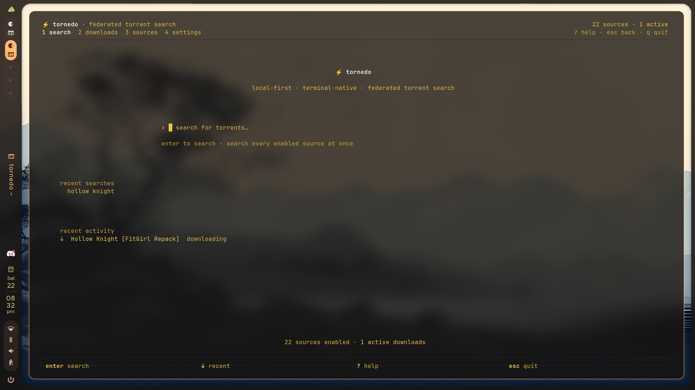
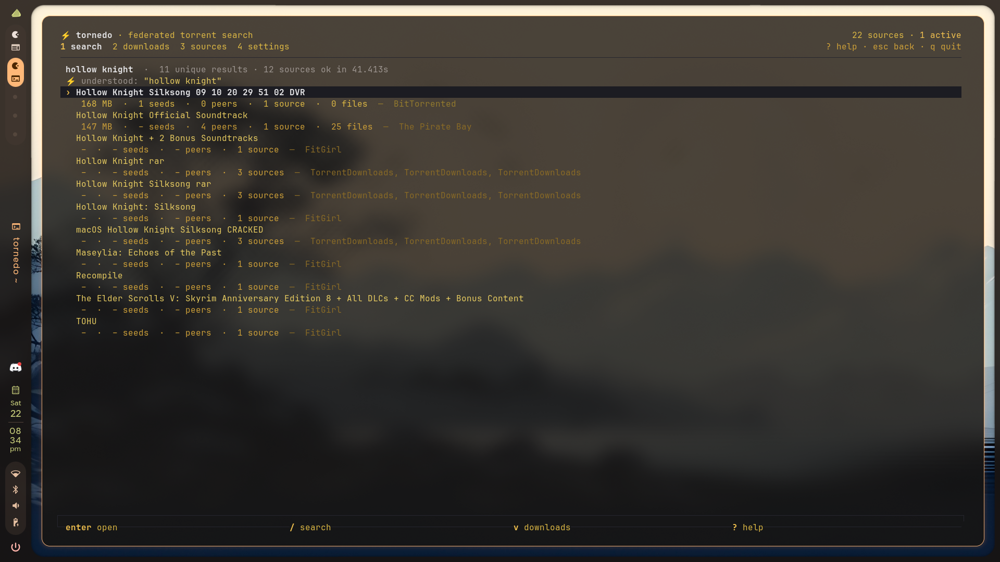
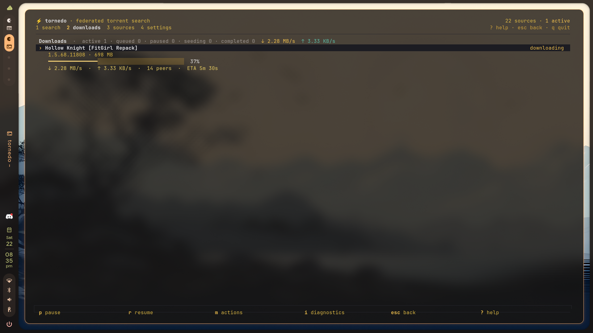
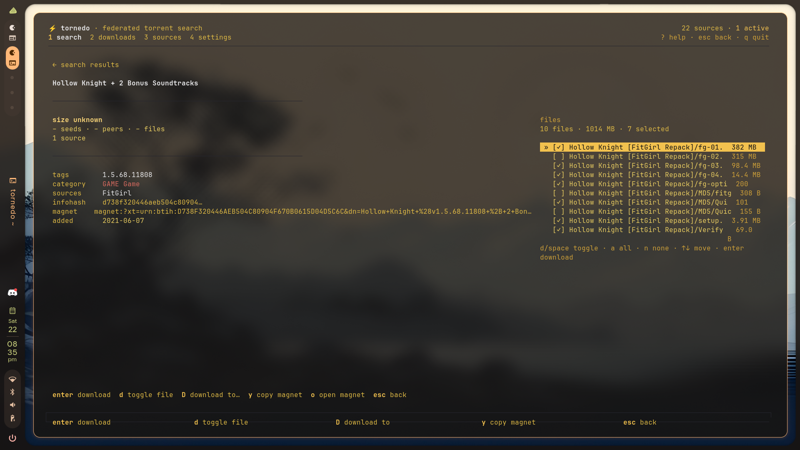

<div align="center">

# ⚡ tornedo

**Local-first · Terminal-native · Federated torrent search & download**

[](https://github.com/Itshardtofindagoodname/Tornedo/actions/workflows/ci.yml)
[](https://www.npmjs.com/package/tornedo)
[](https://nodejs.org)
[](LICENSE)
[](https://github.com/Itshardtofindagoodname/Tornedo/pulls)

Search many torrent sites **at once**, get one clean, ranked, de-duplicated
result set, and download with a fast native engine — all without an account,
a cloud, or any telemetry. State lives in a local SQLite database and
survives restarts.

<br>



<br>

```sh
tornedo search "dune"          # one federated search, every source
tornedo search "cyberpunk" --json | jq .results
tornedo magnet "magnet:?xt=urn:btih:..."
tornedo                        # terminal UI
```

</div>

---

## 📸 See it in action

| 🔍 Federated results | 🚀 Live downloads |
| :---: | :---: |
|  |  |
| *One query → every source → merged & ranked* | *Progress, speeds, peers and ETA at a glance* |

| 🗂️ File-level control | |
| :---: | :---: |
|  | |
| *Pick exactly the files you want before downloading* | |

---

## ✨ Highlights

- 🔎 **Federated search** — every enabled source runs concurrently with its own
  timeout and fault isolation; a slow or dead source never blocks the others.
  Results stream in as each source settles. Transient failures (timeouts,
  outages, 5xx) are retried once with a short backoff; parse failures never are.
- 🧠 **Smart results** — titles are parsed into structured metadata (quality,
  codec, audio, HDR, editions, languages, season/episode ranges, game platform
  and version…), identical torrents from different sites are merged, everything
  is deterministically ranked, and releases group by title/year/season with each
  quality as a variant.
- 🪄 **Intelligent search** — every query is analyzed (media type, title,
  artist/album, year, quality, season/episode) without ever over-asserting: a
  confident parse boosts matching releases and prefers the sources that carry
  that media type; an ambiguous query degrades to a plain search.
- ⬇️ **Fast downloads** — WebTorrent engine behind a thin abstraction, persistent
  queue, resume support, per-torrent and global speed limits, seeding.
- 💥 **Crash recovery** — a run marker in the SQLite database tells startup whether
  the previous run ended cleanly. If it crashed, interrupted downloads are
  reconciled (progress preserved, pieces re-verified) and the UI shows exactly
  what was resumed, completed and failed.
- 🖥️ **Terminal UI** — an elegant, component-driven TUI built on **Ink + React**:
  search, results with category/sort/filter controls, live source status,
  details, downloads with a full action menu, and help. Every keybinding is
  configurable and shown on-screen.
- 🤖 **Headless** — everything the UI can do is available as commands with
  `--json` output.
- 🩺 **Self-diagnostics** — `tornedo doctor` inspects the config, database,
  download directory, disk space, engine, network, DHT, trackers and sources,
  and reports each check with an actionable fix.
- 👀 **Watch mode** — drop `.torrent` or `.magnet`/magnet-URI files into a folder
  and they are added automatically.
- 🎬 **Stream & watch** — `tab` on the home screen flips into streaming mode:
  search MovieBox, 4KHDHub and your Stremio addons (Cinemeta ships by default),
  browse results and episode lists, and play direct streams in
  **mpv/VLC/IINA** with subtitles, per-episode resumes, one-click downloads,
  favorites and a watch history — all terminal-native.
- 🔒 **Private by design** — no accounts, no tracking, no analytics. Config and
  database live on your machine.

---

## 📦 Install

Requires Node.js >= 22.

Install the CLI globally from npm:

```sh
npm install -g tornedo
```

The `tornedo` command is then available in any directory:

```sh
tornedo               # terminal UI
tornedo --help        # usage
tornedo search "dune" # one federated search, every source
```

> [!NOTE]
> **npm 11.16+ / npm 12 (`allowScripts`).** Recent npm releases require install
> scripts (native addon builds, etc.) to be explicitly approved. `tornedo` ships
> **no install scripts of its own**, but it depends on third-party native
> packages (`better-sqlite3`, and WebTorrent's optional WebRTC/uTP/WebSocket
> addons). If your npm prints an `install-scripts` warning on a fresh install,
> approve the packages once with:
>
> ```sh
> npm install -g tornedo --allow-scripts=better-sqlite3,bufferutil,utf-8-validate,node-datachannel,utp-native
> ```
>
> or persist the allowlist with `npm install-scripts approve <pkg>` inside a
> project. Everything runs on TCP even if the optional addons are skipped.
>
> Note that this `allowScripts` mechanism only concerns the **warning** above.
> It does not fix the unrelated global-install failure described below — that
> one fails with exit code 254 before any scripts matter.

> [!WARNING]
> **npm global installs may fail with exit code 254 (`ip-set` / npx ENOENT).**
> A transitive dependency (`webtorrent` → `load-ip-set` → `ip-set@3.0.0`) ships
> a `preinstall: npx only-allow pnpm` script in its published tarball. On some
> npm versions this nested `npx` crashes during **global** installs when its
> cache entry doesn't exist yet, aborting the whole install with an error like:
>
> ```
> npm error code 254
> npm error path .../node_modules/ip-set
> npm error command sh -c npx only-allow pnpm
> npm error npm error code ENOENT ... Could not read package.json
> ```
>
> This is tracked upstream at [fisch0920/ip-set#15](https://github.com/fisch0920/ip-set/issues/15)
> and only affects `npm install -g` — local installs and installs where the npx
> cache is already warm succeed fine. Until upstream republishes, pre-warm the
> cache once before installing (the red "Use pnpm" box it prints is expected —
> ignore it):
>
> ```sh
> npx --yes only-allow pnpm     # exits 1 with a "Use pnpm" box — expected, ignore it
> npm install -g tornedo
> ```
>
> Alternatively, install with pnpm, which satisfies the guard outright:
>
> ```sh
> pnpm add -g tornedo
> ```

### 🛠️ Build from source (developers)

```sh
git clone https://github.com/Itshardtofindagoodname/Tornedo.git
cd Tornedo
npm install
npm run build        # compiles TypeScript to dist/
npm run dev -- search "dune"   # run from source without building
```

The CLI entry point is `dist/cli.js`. To test the built package locally without
publishing, pack and install it:

```sh
npm pack
npm install -g ./tornedo-4.1.0.tgz
```

---

## ⌨️ Commands

```
tornedo search <query>     Search every enabled source (streams results)
tornedo search <query> --category Music
tornedo downloads          List the queue and active torrents
tornedo magnet <uri>       Add a torrent by magnet URI (waits for completion)
tornedo infohash <hash>    Add a torrent by bare infohash
tornedo file <path>        Add a .torrent file
tornedo file <path> --select <paths>   Download only the listed files
tornedo files <input>      List a torrent's files before downloading
tornedo watch <dir>        Watch a directory for .torrent / magnet files
tornedo history            List recent searches
tornedo history --clear    Clear recent search history
tornedo tv                 List live-TV playlists (Watch mode)
tornedo tv add <url> [n]   Add a live-TV playlist (m3u8 url / file path)
tornedo tv remove <name>   Remove a live-TV playlist
tornedo tv search <q>      Search live-TV channels across configured playlists
tornedo tv test <url>      Probe a playlist, report channels / groups
tornedo tv clear           Remove all live-TV playlists
tornedo addons             List installed Stremio addons (Watch mode)
tornedo addons add <url>   Install a Stremio addon (validates manifest)
tornedo addons remove <u>  Remove an installed addon
tornedo addons clear       Forget all installed addons (Cinemeta stays)
tornedo config             Show / set configuration
tornedo sources            List sources and their enabled state
tornedo sources --check    Diagnose Torznab / Internet Archive providers
tornedo doctor             Run self-diagnostics (config, DB, disk, network…)
tornedo doctor --check     Include live endpoint capability probes
tornedo doctor --json      Machine-readable report
tornedo clear              Delete all downloads and wipe local state
tornedo uninstall [--clear] Uninstall the npm package (optionally wiping first)
tornedo tui                Terminal UI (default when no command)
```

Common flags: `--json` (machine-readable output on stdout only), `--source <id>`
(repeatable), `--category <cat>`, `--limit <n>`, `--dir <dir>`, `--select <paths>`
(repeatable / comma-separated), `--seed` / `--no-seed`, `--no-wait`, `-y/--yes`,
`-q/--quiet`. See `tornedo help`.

---

## 🖥️ Terminal UI

| Key | Action |
| :--- | :--- |
| `↑/k` `↓/j` | navigate |
| `enter` | download — in the details inspector it commits the checked files |
| `d` | toggle the highlighted file for download (details file panel) |
| `D` | download to a chosen directory (then `p`/`r`/`x`/`s`/`m`/`o` manage it) |
| `c` | category scope for the current results |
| `t` | sort order for the current results |
| `ctrl+f` | refine the results with a filter (min/max size, source, resolution, codec, audio, language, quality) |
| `i` | details inspector — the file list sits in a right-hand panel, every file checked by default (`d`/`space` toggle · `a` all · `n` none · `enter` download · `esc` back) |
| `/` | search again |
| `v` | downloads view |
| `p` / `r` | pause / resume selected download |
| `x` | remove selected download |
| `s` | toggle seeding |
| `m` | action menu for the selected download (cancel, delete files, open folder…) |
| `y` | show selected magnet |
| `o` | open selected magnet in your default handler |
| `?` | help |
| `q` | quit |

### ▶️ Watch mode (streaming)

`tab` on the home screen toggles the search into **streaming mode** — enter
runs a streaming search across **MovieBox**, **4KHDHub**, your installed
Stremio addons (Cinemeta + Anime Kitsu ship by default), any **live-TV
playlists** and the **Torrent** source (ranked results from Tornedo's own
torrent engine), returning matching titles instead of torrents. `enter` opens the
title; series show an episode list (`tab` switches between episodes and
streams); `enter` plays the selected stream in **mpv / VLC / IINA**; live-TV
channels play straight from their m3u8 URL. `d` downloads a stream (Range
resume via `.part` files), `s` picks subtitles (MovieBox), `o` opens with a
chosen player, `R` switches resolution, `*` toggles a favorite. mpv writes its
position back on exit so *Continue watching* resumes where you left off;
favorites and history are stored under the data dir. Install at least one
player for playback.

Everything ships enabled out of the box — no addon, playlist or config step
is required to start watching:

- **MovieBox** and **4KHDHub** play most movies/series directly.
- **BDIX** (CircleFTP, Bangladesh-ISP only) is enabled by default; on networks
  that can't reach Bangladeshi links it simply shows nothing ("unreachable")
  instead of erroring, and the search skips a dead BDIX endpoint for a few
  minutes so it never slows you down. Toggle it with the `bdixEnabled` config
  key (Settings or `tornedo config set`).
- **Addons** enrich search and home rows; torrent-only results fall back to the
  bundled providers for playback.
- **Torrent** results stream through **WebTorrent**: selecting one starts
  streaming the best file over a local HTTP stream, playing in your player while
  pieces download.
- **IPTV** lives under `tornedo tv` — add any m3u8 playlist (URL or file) and
  channels appear in watch searches with a `live tv` tag.

```
tornedo addons list                # installed addons + stream capability
tornedo addons add <url>           # install an addon (manifest is validated)
tornedo addons remove <url|id>     # uninstall one
tornedo addons clear               # forget all (Cinemeta + Kitsu stay as defaults)
```

An addon marked `streams: no` still helps discovery — Watch mode will find
playable streams for its results on the bundled providers.

| Watch key | Action |
| :--- | :--- |
| `tab` | toggle home search between **download** (torrents) and **watch** (streaming) |
| `enter` | play the selected stream / open the selected episode list |
| `d` | download the selected stream with resume support |
| `s` | pick subtitles for the selected stream |
| `o` | open the selected stream with a chosen player |
| `R` | choose a resolution (MovieBox/4KHDHub) |
| `*` / `f` | toggle favorite |

Keybindings are configurable under `keybindings` in the config file.

---

## 🌐 Sources

Enable/disable any source (`tornedo sources`, then
`tornedo config set sources.<id> true|false`). Built-in adapters: **FitGirl
Repacks** (games), **YTS** (movies), **The Pirate Bay** (movies/TV/music),
**1337x** (movies/TV/music), **LimeTorrents**, **TorrentGalaxy**, and
**TorrentDownloads** (music), **EZTV** (TV), **Nyaa** (anime), **SubsPlease**
(anime), and a **BitTorrented** general feed. Sources that report real swarm
health (seeders) are ranked preferentially.

User-configured providers are first-class sources:

- 🧩 **Torznab/Newznab** — point at any local indexer (Prowlarr, Jackett, nZEDb,
  …). Tornedo discovers what the endpoint supports (`?t=caps`) and never
  guesses; an endpoint without a `music` capability reports
  `unsupported` instead of returning empty results. Configure under
  `torznabProviders` and verify with `tornedo sources --check`.
- 📼 **Internet Archive** — public audio items via the archive.org JSON APIs.
  Only items with downloadable audio files are surfaced. Not a torrent swarm;
  the UI explains why an `ia://` item cannot be queued into the torrent engine.
  Configure under `internetArchive` (disabled by default).

For music searches the robust providers above are the recommended path — the
HTML indexers above are fast-path fallbacks and fail loudly (never silently
empty) when their page structure changes.

---

## ⚙️ Configuration

`tornedo config` prints the effective config as JSON. Files live at:

- Config: `<config-dir>/tornedo/config.json`
- Database: `<data-dir>/tornedo/tornedo.sqlite` (SQLite, WAL)

Set `TORNEDO_STATE_DIR` to relocate both (also used by the test suite).

| Key | Meaning |
| :--- | :--- |
| `downloadDir` | where completed data lands |
| `maxActiveDownloads` | concurrent active downloads (`0` = unlimited) |
| `maxDownloadSpeed` / `maxUploadSpeed` | global limits in B/s (`0` = unlimited) |
| `sourceTimeoutMs` | per-source search timeout |
| `sources` | `sourceId -> enabled` map |
| `seedAfterComplete` | default seeding behavior |
| `diskSpaceWarningMb` | minimum free space (MiB) flagged by `tornedo doctor` |
| `recoveryAutoResume` | resume interrupted downloads automatically after a crash |
| `ranking.*` | ranking weights (seeders, quality, health, size) |
| `keybindings.*` | action -> key names (see `tornedo help`) |
| `watchIntervalMs` | watch-mode poll interval |
| `searchAction` | what `enter` on home does: `"download"` (torrents) or `"watch"` (streaming) |
| `streamingEnabled` | master switch for streaming ("Watch") providers |
| `bdixEnabled` | Bangladesh-ISP-only BDIX providers (CircleFTP; on by default) |
| `defaultPlayer` | preferred player: `"mpv"`, `"vlc"`, `"iina"`, or `null` = auto-detect |
| `streamDownloadDir` | where Watch-mode downloads land (`null` = `downloadDir`) |
| `theme` | terminal theme: `default`, `mocha`, `latte`, `macchiato`, `frappe`, `nord`, `tokyonight`, `dracula`, `gruvbox`, `rosepine` |
| `torznabProviders[]` | user-configured Torznab/Newznab endpoints (see below) |
| `internetArchive` | Internet Archive provider settings (below) |

### 🧩 Torznab providers

`torznabProviders` is an array of objects; each entry adds one source:

```json
{
  "torznabProviders": [
    {
      "id": "prowlarr",
      "name": "Prowlarr",
      "baseUrl": "http://localhost:9117/api/v1",
      "apiKey": "your-api-key",
      "enabled": true,
      "categories": ["Music", "Movie", "TV"],
      "timeoutMs": 15000,
      "priority": 1
    }
  ]
}
```

| Field | Meaning |
| :--- | :--- |
| `id` | stable id (defaults to `torznab:<index>`) |
| `name` | label shown in source lists |
| `baseUrl` | base URL of the Torznab API (required) |
| `apiKey` | `apikey` query param (empty for open endpoints) |
| `enabled` | participates in searches |
| `categories` | media categories to search (empty = whatever the endpoint reports) |
| `timeoutMs` | per-request timeout (defaults to `sourceTimeoutMs`) |
| `priority` | lower runs first when several providers are configured |

`tornedo sources --check` fetches each endpoint's `?t=caps` and reports which
query modes (`search` / `music` / `movie` / `tv`) it really supports.

### 📼 Internet Archive

```json
{ "internetArchive": { "enabled": false, "timeoutMs": 15000, "maxResults": 30 } }
```

| Field | Meaning |
| :--- | :--- |
| `enabled` | participate in searches |
| `timeoutMs` | per-request timeout |
| `maxResults` | max items returned per search |

Enable it with `tornedo config set internetArchive.enabled true`. Nested keys
are settable as dotted paths; add/remove Torznab entries by editing
`config.json` (arrays cannot be appended from the CLI).

---

## 🧑‍💻 Development

```sh
npm run typecheck    # strict TypeScript, no emit
npm test             # unit + integration (fake sources, no network)
npm run test:bench   # throughput benchmarks
npm run build
```

The test suite never touches your real config or database (`TORNEDO_STATE_DIR`
points at a temp directory). The search engine, download manager, and CLI are
covered end-to-end with fake sources and a fake torrent client.

---

## 🏗️ Architecture

```
src/
  model/       domain types (search, torrent, source)
  config/      config schema + OS paths
  database/    SQLite schema, migrations, store
  torrent/     TorrentClient abstraction, WebTorrent engine, parsing
  downloads/   download manager (queue, scheduler, seeding, crash recovery)
  sources/     source adapters + shared net/rss helpers
  search/      federated search engine (fault-isolated, concurrent, retrying)
  media/       query analysis, title/audio parsing, classification, entity building
  results/     dedupe, ranking, grouping, filtering, sorting
  diagnostics/ self-diagnostics used by `tornedo doctor`
  app/         Application wiring + session-based search service
  watch/       watch-mode service
  cli/         commands + arg parsing
  ui/          Ink/React terminal UI (views, components, key handling)
```

---

<div align="center">

## 📄 License

MIT. See [LICENSE](LICENSE) and [NOTICE](NOTICE).

<br>

**⚡ tornedo** — *search everything, download anywhere, own your data.*

</div>
